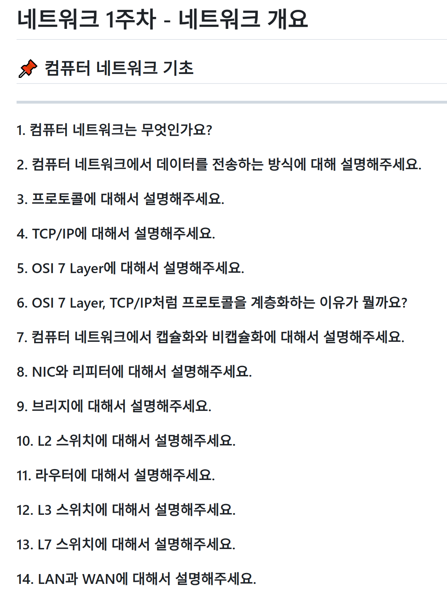
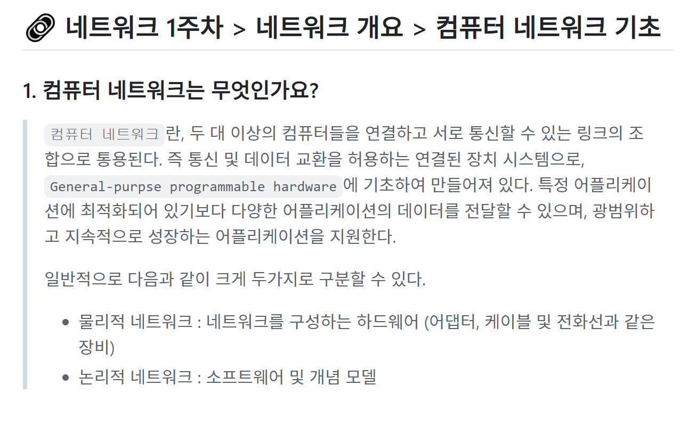
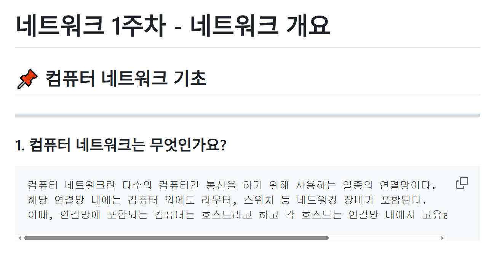

### 1. 스터디 소개
#### 1.1. 스터디 배경 및 필요성
IT 기업에 지원하기 위해서는 프로젝트 경험도 중요하지만 이를 뒷받침하는 CS 지식 또한 프로젝트 경험 못지 않게 중요합니다. 
전공 수업에서 이와 관련된 지식을 학습하고 알고 있지만 이를 말로 표현하기는 쉽지 않습니다.
이 면접 스터디의 목표는 학교에서 학습한 CS 지식 중 서비스 기업에서 자주 물어보거나 중요한 파트를 심도있게 학습하여 기술 면접 시 경쟁력을 갖추기 위함입니다.
또한 학습한 내용을 블로그와 github에 기록하는 과정을 통해 추후 실제로 면접을 보기 전 회고할 수 있도록 하며 또한 이 블로그를 팀원과 공유하여 올바르게 학습했는지 검증할 수 있어 정확한 학습을 할 수 있습니다.
 

#### 1.2. 스터디 목표 및 주요내용

##### 1.2.1 네트워크 학습(5주)
1. 네트워크, 프로토콜, OSI Layer 학습
2. Application Layer 학습 1 - HTTP
3. Application Layer 학습 2 – 쿠키/세션, REST, 프록시
4. Transport Layer 학습 – TCP/UDP
5. Network Layer 학습 – 논리적 주소, 패킷

##### 1.2.2 운영체제 학습(5주)
1. 운영체제, 시스템 콜, 폴링/인터럽트 학습
2. 프로세스, 쓰레드 학습
3. 기아 상태, 스케줄링 학습
4. 동시성,병렬성 및 제어 방법 학습
5. 가상 메모리 학습

#### 1.3. 세부내용

##### 1.3.1 주차별 예상 질문 공유

매주 특정 토픽에 대한 면접 기출 질문 또는 예상 질문을 공유합니다.
팀원들은 각자 예상 질문에 대답할 수 있을 수준이 되도록 공부합니다.
 

##### 1.3.2 학습한 내용 정리

학습한 내용을 블로그 및 github 리포지토리에 정리하여 추후 면접 대비 시 활용할 수 있도록 기록합니다.
또한 팀원들과 각자 학습한 내용을 공유하여 몰랐던 부분, 부족한 부분을 보완할 수 있습니다.

##### 1.3.3 모의 면접 진행

10월 7일 대면으로 스터디를 진행하여 서로 학습한 내용을 설명하고 이를 피드백하는 시간을 가졌습니다.
개인 일정 등으로 대면 스터디를 자주 갖지 못했지만 11월부터 2주에 한번씩 대면 스터디를 진행하여 주기적으로 피드백을 받을 수 있는 시간을 가질 예정입니다.
