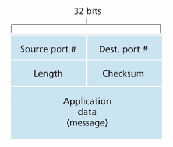
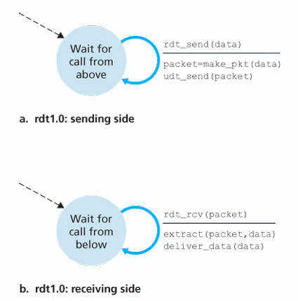
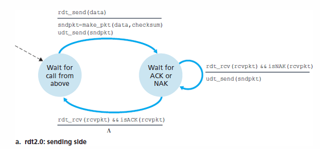
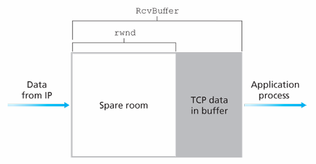

# 1. UDP

## 1) UDP(User Datagram Protocol)

UDP(User Datagram Protocol)은 비신뢰적이고 비연결형인 서비스를 제공하는 트랜스포트 계층이다.
트랜스포트 계층은 네트워크 계층의 서로 다른 호스트 사이의 전달 서비스를 **프로세스 사이의 전달 서비스**로 확장한다.
UDP는 트랜스포트 계층의 가장 기본적인 기능을 제공한다.

1. 프로세스와 프로세스 사이 통신할 수 있도록 한다.(다중화와 역다중화)
2. 오류를 검출한다.

## 2) UDP의 장단점

UDP는 트랜스포트 계층 프로토콜이 할 수 있는 최소한의 기능으로 동작한다.
호스트에서 들어온 데이터그램을 적절한 프로세스에게 넘겨주는 다중화 기능과 최소한의 오류 검출 기능만을 제공한다.

이렇게 최소한의 기능만 제공함으로써 발생하는 장단점이 있다.

### 장점

- 애플리케이션 레벨에서 더 정교한 구현

UDP는 최소한의 기능만을 제공하여 애플리케이션 레벨에서 다양한 방식으로 확장할 여지가 많다.
HTTP/2가 TCP의 태생적인 한계로 인해 HTTP/3에서 UDP를 바탕으로 애플리케이션 레벨에서 커스텀한 QUIC 프로토콜이 등장한 것 처럼 애플리케이션 레벨에서 더 정교한 제어를 할 수 있다.

- 연결을 위한 초기 설정이 없다

TCP는 데이터 전송을 시작하기 전에 핸드셰이크를 활용한다. 
반면 UDP는 연결을 구축하기 위한 어떠한 지연도 없으므로 빠르다.

- 연결 상태가 없다

UDP는 연결을 유지하기 위한 어떠한 버퍼 등이 필요하지 않아 서버에서 좀 더 많은 클라이언트와 통신할 수 있다.

- 작은 패킷 헤더 오버헤드

최소한의 기능만을 가지고 있기 때문에 필요한 정보가 단순하여 헤더의 크기가 작다.
TCP는 세그먼트마다 20바이트의 헤더 오버헤드를 갖지만 UDP는 단지 8바이트의 오버헤드를 가진다.

### 단점

- 신뢰성 부족

UDP는 비연결형 프로토콜로 데이터 전송 시 신뢰성을 보장하지 않는다.
중간에 데이터가 손실되더라도 재전송과 같은 추가적인 방어 장치가 없다.
또한 데이터의 전송 순서도 보장하지 않는다.

- 흐름 제어와 혼잡 제어 없음

네트워크가 혼잡한 상태에서도 전송률을 조정하지 않아 데이터가 손실될 위험이 TCP보다 높다.

하지만 이러한 단점은 애플리케이션 레벨에서 추가적인 구현으로 극복할 수 있어 최근에는 UDP를 기반으로 하는 애플리케이션 레이어 프로토콜 또한 많다.

## 3) UDP 체크섬

UDP 체크섬은 오류 검출을 위한 추가적인 데이터이다.
UDP 체크섬을 생성하는 과정은 다음과 같다.

1. 데이터를 16비트 워드로 쪼갠다.
2. 각각의 워드를 합산한 후 1의 보수를 수행한다.

이러한 UDP 체크섬을 추가하여 수신자에게 전달한다.
수신자는 똑같이 데이터를 16비트 워드로 쪼개어 합산한 후 체크섬과 더한다.
만약에 오류가 없다면 모든 비트는 1이 된다.
0인 비트가 있다면 패킷에 오류가 발생했음을 알 수 있다.

### UDP 체크섬을 사용하는 이유?

링크 계층 프로토콜이 오류 검사를 제공하는데 UDP 체크섬이 따로 필요한 이유는 출발 프로세스와 도착 프로세스 사이 모든 링크가 오류 검사를 제공한다는 보장이 없기 때문이다.
링크 계층에서 정확히 전송되었더라도 상위 계층에서 세그컨트가 라우터의 메모리에 저장할 때 등의 상황에서 비트 오류가 발생할 수 있다.

---

# 2. 신뢰적 데이터 전송

## 1) 신뢰적 데이터 전송

신뢰적 데이터 전송 프로토콜은 신뢰적인 채널을 추상화하여 제공하는 프로토콜이다.
어떻게 신뢰적인 채널을 구축하는지는 상위 계층이 알 필요 없이 신뢰적인 채널 내에서는 데이터가 손상되지 않고 데이터는 전송된 순서 그대로 전달된다는 정보만 알고 있으면 된다.

## 2) Stop and Wait 신뢰적 데이터 전송 프로토콜

신뢰적 데이터 전송 프로토콜(RDT, Reliable Data Transfer)은 이러한 신뢰적 데이터 전송 서비스를 구현하는 프로토콜이다.
Stop and Wait 방식은 가장 간단한 신뢰적 데이터 전송 프로토콜 방식으로 데이터를 전송하고 응답이 올 때까지 대기하는 방식으로 구현되었다.

### RDT 1.0

RDT 1.0은 다음을 가정한다.

- 비트 에러가 없다.
- 패킷 손실이 없다.

RDT 1.0은 단순히 호출이 상대방으로부터 올때까지 대기하는 이상적인 방식이다.

### RDT 2.0

RDT 2.0은 **비트 에러**가 있을 수 있고 또한 비트 에러 탐지 능력도 있는 상황을 가정하였다.
하지만 패킷 손실은 여전히 없다.

수신자는 전송한 데이터에 비트 에러가 없으면 ACK로 응답하고 비트 에러가 있으면 NAK로 응답한다.
송신자는 수신자가 보낸 응답이 ACK라면 다음 데이터를 전송하고 NAK라면 다시 데이터를 전송한다.

### RDT 2.1

RDT 2.1은 수신자가 보낸 **ACK나 NAK가 손상**되는 상황도 있다고 가정한다.
수신자의 ACK나 NAK가 손상된 경우 송신자는 수신자가 제대로 받았는지 확인할 방법이 없다.
이 경우 송신자가 패킷을 다시 전송한다면 수신자 또한 다시 전송된 패킷인지 다음 패킷인지 구분할 수 없다.

RDT 2.1에서는 0과 1 두 개의 **시퀀스 번호(Sequence Number)** 를 순환하여 사용한다.

1. 송신자는 1번 데이터를 수신자에게 보낸다.
2. 수신자는 잘 받아서 ACK 1을 송신자에게 보낸다.
3. 송신자는 ACK가 손상되어 다시 1번 데이터를 수신자에게 보낸다.
4. 수신자는 0번 데이터를 받아야하는데 1번 데이터를 받았으므로 무시한다.

### RDT 2.2

RDT 2.2는 아예 NAK가 없다.
수신자가 1번 데이터를 받았는데 비트 오류가 발생했다면 수신자는 NAK 대신 ACK 0을 보낸다.
송신자는 ACK 0을 보고 1번 데이터를 다시 보내면 된다.

### RDT 3.0

RDT 3.0에서는 패킷이 손상된 상황이 아닌 아예 손실된 상황에도 대응할 수 있다.
송신자는 타이머를 가져 이 타이머 동안 ACK를 받지 못한 경우 송신자는 다시 데이터를 전송한다.

## 3) 파이프라인 프로토콜

Stop and Wait는 데이터를 한 번 전송하고 받을 때까지 대기하므로 대부분의 상황에서 사용하기에 무리가 있다.
따라서 여러 데이터를 한 번에 전송하고 받는 파이프라인 방식을 주로 사용한다.

---

# 3. TCP

TCP는 신뢰적 데이터 전송을 바탕으로 하여 여러 기능을 제공한다.
UDT와 달리 연결지향형으로 데이터 전송을 보장하는 연결을 지향한다.
이 연결은 회선 교환과 같은 물리적인 방식이 아닌 논리적인 방식으로 이루어진다.

TCP는 회선 교환처럼 하나의 경로만 사용하는 것이 아닌 패킷은 여러 경로로 나뉘어 전달된다.
하지만 TCP는 순서가 바뀌거나 패킷이 손실되면 재전송 등의 방법을 사용하여 수신자는 **하나의 연결에서 마치 패킷들이 하나의 경로로 순서대로 보낸 것처럼 받을 수 있다.**

## 1) 신뢰적 데이터 전송

TCP는 RDT와 비슷하게 시퀀스 번호를 활용한다.
이 때 TCP는 패킷의 번호가 아닌 **바이트 스트림 번호**이다.
수신자가 ACK를 보낼 때 다음 기대하는 패킷의 바이트 스트림 번호를 보낸다.

연결을 수립한 후 20 바이트의 패킷을 서로 교환했다면 송신자가 30 바이트 패킷을 보내면 수신자는 ACK 50을 응답하는 식으로 구현된다.
또한 파이프라인 프로토콜 중 SR과 같이 손상된 패킷만 선택적으로 재전송하는 방식을 취한다.

## 2) 3 way handshake

연결(Connection)을 수립할 때는 3 way handshake 방식을 사용한다.

1. 클라이언트는 서버에게 SYN 세그먼트(헤더에 SYN 비트가 1)를 전송한다.
2. 서버가 SYN 세그먼트를 받으면 클라이언트와의 연결을 위한 버퍼 등을 할당하고 클라이언트 식별 번호가 포함된 SYN_ACK 세그먼트를 전송한다.
3. 클라이언트는 SYN_ACK 세그먼트를 확인하고 이 SYN_ACK를 잘 받았다는 ACK 세그먼트를 전달한다.

마지막에 서버가 ACK 세그먼트를 받음으로써 서버와 클라이언트는 서로 통신할 준비가 되었음을 확인할 수 있다.

## 3) 4 way handshake

연결을 종료할 때는 4 way handshake 방식을 사용한다.

1. 클라이언트는 연결을 종료할 때 FIN 세그먼트를 전송하여 서버로의 데이터 전송을 종료할 것이라고 알린다.
2. 서버는 FIN 세그먼트를 수신하고 이를 확인하는 ACK 세그먼트를 클라이언트에게 전송한다.
3. 서버가 ACK 전송을 마치면 FIN 세그먼트를 전송하여 클라이언트의 데이터 전송을 종료할 것이라 알린다.
4. 클라이언트는 FIN 세그먼트를 수신하고 이를 확인하는 ACK 세그먼트를 서버에 전송한다.

클라이언트는 마지막 단계에서 ACK 세그먼트를 서버로 전송한 후 대기 시간을 가진 후 연결을 완전히 종료한다.
바로 연결을 종료하지 않고 대기 시간을 가짐으로써 서버가 ACK를 받지 못해 FIN을 재전송하는 상황을 대비할 수 있고 안전하게 연결을 정리할 수 있다.

## 4) TCP 혼잡 제어(Congestion Control)

네트워크가 혼잡해지면 라우터 버퍼들의 오버플로우로 인해 손실이 발생할 수 있다.
패킷 재전송으로 손실을 막을 수는 있지만 네트워크 혼잡이로 인한 근본적인 원인은 해결되지 않는다.
따라서 TCP는 네트워크가 혼잡할 경우 이를 조절할 수 있도록 혼잡 제어 기능을 제공한다.

전통적으로 TCP는 혼잡 제어를 위해 **슬로우 스타트(Slow Start), 혼잡 회피, 빠른 회복** 기능을 제공한다.
TCP는 혼잡 윈도우(Congestion Window)를 추적하여 데이터를 한 번 전송할 때 최대 혼잡 윈도우 크기 만큼의 세그먼트만 전송할 수 있도록 제한하여 전송률을 제어한다.

### (1) 슬로우 스타트

처음부터 많은 세그먼트를 보내는 대신 세그먼트의 전송 속도를 천천히 증가시키면서 네트워크의 부하를 천천히 증가시키도록 한다.
처음에는 혼잡 윈도우의 크기가 1 MSS(Maximum Segment Size)부터 시작하여 하나의 세그먼트의 확인 응답을 받을 때마다 
혼잡 윈도우 크기를 +1한다.
따라서 모든 세그먼트가 정상적으로 전송되었을 경우 혼잡 윈도우의 크기는 1 -> 2 -> 4 -> 8 -> ... 이런 식으로 증가한다.
이러한 지수적 증가는 TCP의 또 다른 상태 변수인 **ssthresh**(slow start threshold) 값에 도달할 때까지 증가한다.

### (2) 혼잡 회피

ssthresh 값에 도달하면 혼잡 윈도우의 지수적 증가를 멈추고 RTT마다 혼잡 윈도우 크기를 +1한다.

### (3) 네트워크의 혼잡 감지
TCP는 크게 두 가지 방법으로 네트워크의 혼잡을 감지한다.

1. 타임 아웃이 발생하였다.
2. 3개의 중복된 ACK 시퀀스 번호를 받았다.(빠른 재전송)

타임 아웃이 발생했다는 말은 송신자가 보낸 세그먼트가 손실되었거나 수신자가 보낸 ACK 응답이 손실되었다는 의미이다.
이 경우에 네트워크가 매우 혼잡한 것으로 여기고 혼잡 윈도우 크기를 1 MSS로 설정하고 ssthresh 값은 타임 아웃이 발생 했을 때 혼잡 윈도우 크기의 절반으로 설정한다.

3개의 중복된 ACK 시퀀스를 받은 경우 송신자가 보낸 세그먼트를 수신자가 받았지만 순서가 보장되지 않거나 특정 세그먼트가 손실되었다는 의미이다.
이 때는 타임아웃이 되지 않아도 네트워크가 혼잡하다고 간주하여 타임아웃이 되기 전에 즉시 세그먼트를 다시 전송한다.
빠른 회복은 이 상황에서 이전 타임 아웃보다는 덜 혼잡하다고 보고 혼잡 윈도우 크기는 중복 ACK를 수신한 시점의 혼잡 윈도우 크기의 절반으로 줄이고 +3 MSS를 하며 ssthresh 값 또한 혼잡 윈도우 크기의 절반으로 줄인다.

### (4) 빠른 회복(Fast Recovery)

빠른 회복은 TCP의 필수 사항은 아니다.
초기 TCP 버전인 TCP Tahoe에서는 빠른 회복을 지원하지 않아 중복된 ACK 시퀀스 번호를 받아도 혼잡 윈도우 크기를 1 MSS로 설정하였다.
하지만 이후 버전힌 TCP Reno에서는 빠른 회복을 지원하여 혼잡 윈도우 크기를 절반으로 나누고 +3을 한다음 혼잡 회피 과정을 수행한다.

## 5) TCP 흐름 제어(Flow Control)

TCP 연결에서 서버는 각 연결에 대한 버퍼를 가지고 있다.
이 때 서버의 처리 속도가 트래픽을 따라가지 못한다면 버퍼에 점점 더 데이터가 쌓일 것이고 어느 순간 오버플로우가 발생할 수 있다.

이 상황에서 TCP는 수신자의 버퍼를 오버플로우 시키는 것을 방지하기 위해 흐름 제어 서비스를 제공한다.
이는 **수신하는 애플리케이션이 읽는 속도와 송신자의 전송 속도를 일치**시키는 작업이다.

TCP는 송신자가 **수신 윈도우**를 유지하여 흐름 제어를 제공한다.

수신자는 송신자에게 현재 얼마나 여유 공간(rwnd)가 있는지 세그먼트를 응답할 때마다 알려준다.
송신자는 ACK를 응답받을 때 마지막으로 보낸 데이터 바이트 수 - 마지막으로 응답받은 데이터 바이트 수가 여유 공간보다 작다면 충분히 보낼 수 있다고 보고 세그먼트를 전송한다.
이 때 여유 공간이 없다면 송신자는 데이터를 전송하지 않으므로 ACK 또한 받지 않는다.
따라서 이 경우 영원히 재시작할 수 없으므로 송신자는 수신자에게 1바이트 세그먼트를 계속 보내어 여유 공간이 얼마인지 주기적으로 알아낸다.

# Reference

James F. Kurose,Keith W. Ross 편저, 최종원 외 7인 옮김, 컴퓨터 네트워킹 하향식 접근 8판, 퍼스트북

[https://velog.io/@devharrypmw/TCPUDP-TCP%EC%99%80-UDP%EC%9D%98-%ED%8A%B9%EC%A7%95%EA%B3%BC-%EC%B0%A8%EC%9D%B4](https://velog.io/@devharrypmw/TCPUDP-TCP%EC%99%80-UDP%EC%9D%98-%ED%8A%B9%EC%A7%95%EA%B3%BC-%EC%B0%A8%EC%9D%B4)